# AI Companion System — Week 1 Architecture
🌟 Overview

This project is an AI Companion System designed to help track and summarize my daily learning or reflective conversations.
The system demonstrates a multi-agent architecture that mirrors modern AI platform design — combining reasoning, memory, and orchestration.

At its core:

- The Companion Agent is the user-facing layer — it interacts in natural language, maintains context, and delegates complex reasoning to specialized sub-agents.

- The Planner Agent functions as an intelligent back-office agent — it decides what information to store or retrieve, helping the Companion maintain meaningful long-term memory.

- The Memory System (Vector DB) stores learnings and contextual embeddings for retrieval across sessions.

This structure mimics how production-grade AI systems separate interaction, planning, and memory — and will evolve into a more capable orchestrated system in later demos.

## Architecture

```mermaid
flowchart LR
    %% === User Interaction Layer ===
    user([👤 User]):::human
    
    %% === Companion Agent ===
    subgraph A[Companion Agent]
        A1[Receive message / input]
        A2[Interpret intent]
        A3[Call Planner Agent via A2A]
        A4[Generate response]
    end

    %% === Planner Agent ===
    subgraph B[Planner Agent]
        B1[Analyze content importance]
        B2[Decide what to store/retrieve]
        B3[Interact with Vector DB]
        B4[Return structured context]
    end

    %% === Data Layer ===
    subgraph C[Memory System / Vector DB]
        C1[(Embeddings)]
        C2[(Stored Learnings)]
    end

    %% === Connections ===
    user -->|chat input| A1
    A1 --> A2 --> A3
    A3 -->|A2A request| B1
    B1 --> B2 --> B3 --> C1
    C1 --> C2
    B4 -->|context summary| A4
    A4 -->|response| user

    %% === Styling ===
    classDef human fill:#f7d9d9,stroke:#b22222,stroke-width:1px,color:#111;
    classDef agent fill:#e6f3ff,stroke:#007acc,stroke-width:1px,color:#111;
    classDef db fill:#fff3e6,stroke:#cc8400,stroke-width:1px,color:#111;

    class A,B agent;
    class C db;
```


## Prerequisites

- Python 3.8+
- OpenAI API key

## Installation

1. Clone or download this project
2. Create a virtual environment:
   ```bash
   python -m venv venv
   source venv/bin/activate
   ```

3. Install dependencies:
   ```bash
   pip install -r requirements.txt
   ```

4. Set up your OpenAI API key:
   ```bash
   cp .env.example .env
   # Edit .env and add your OpenAI API key
   ```

## Usage

Run the agent:
```bash
python main.py
```

Or run the agent directly:
```bash
python agent.py
```

## How it Works

The agent uses LangGraph to create a simple workflow:

1. **Process Input**: Takes user input and adds it to the conversation
2. **Generate Response**: Uses OpenAI's GPT model to generate a response
3. **Format Output**: Formats the response with a friendly greeting

## Project Structure

```
├── agent.py          # Main agent implementation
├── main.py           # Entry point
├── requirements.txt  # Python dependencies
├── .env.example      # Environment variables template
└── README.md         # This file
```